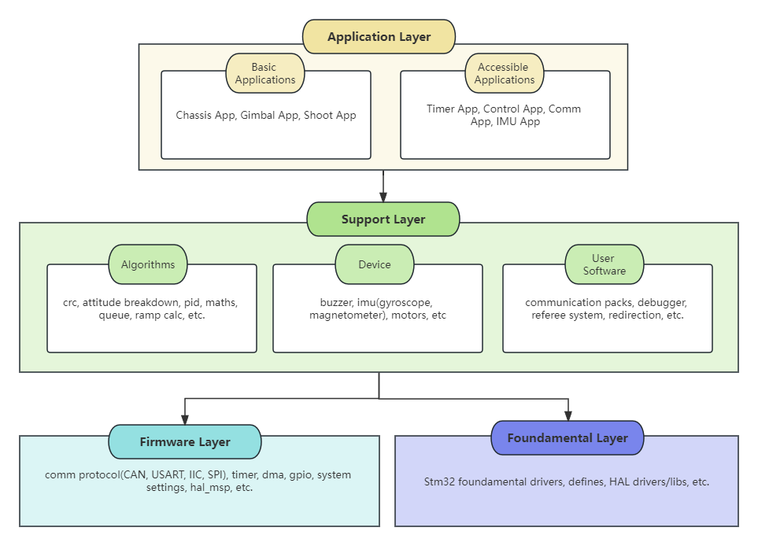
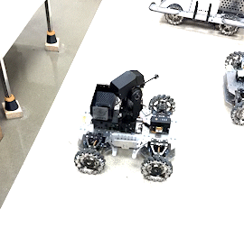

# UARM-E&C-Team-Basic-Frame-Type-C

 


This project serves as the foundational embedded code framework for the *UARM 2023-2024 season*. By implementing a unified code framework, we aim to standardize the structure of robot control logic, which in turn, enhances the code's readability and allows for seamless future optimization of both the architecture and the code itself. Our aspiration is to bolster the project's portability and robustness throughout its developmental journey.

* **Development Board**: Robomaster Type-C Development Board with STM32F407IGHx
* **Tool Chain**:
  * STM32CubeIDE v1.8.0
  * STM Studio with JRE v7+
  * ST-Link Debugger
* Have questions? Contact: alex.haoranqi@gmail.com


## Layout




## Note

* When you edit  files, please make sure that your code is supposed to be written within the customized user commit, or it would be erased by regenerating the files

  ```c
  /* USER CODE BEGIN SysInit */
  YOUR_CODE_HERE();
  /* USER CODE END SysInit */
  ```

* When you would like to create a new file, please copy the code&header template in the folder `Code_Template`. Please also follow the commit style in those files.

  ```c
  Code_Templates
  	 |_ any_code.c	
        |_ any_header.h
  ```

* Some plugins for CubeIDE(Go to Help->Eclipse Marketplace to download):
  * *Tabnine*: AI powered autocomplete tools for Eclipse editor.

* This project uses *CMSIS/DSP* to accelerate the matrix operation. To access the DSP in our project, follow this [link](https://www.youtube.com/watch?v=lwsWaMeP1co).

* The code need to be modified for different robots. Please notice the motion of the yaw gimbal will significantly impact the performance of the code.


## Mode Demo

* Gimbal Follow（Encoder Mode）

  

* Self-Gyro（Gyro or Encoder Mode）

  

* Gimbal Center(Gyro mode)

  

* Ground mode(Encoder Mode)

## Application  level  Structure (Currently use FreeRTOS)

### Chassis Application

 Process the signal movement along the rail Timer interrupt and apply the value of 3508 motors using CAN.

### Gimbal Application

 Receive and parse the packets sent by MINI PC through UART6. Then Apply the parsed absolute pitch/yaw angle and the fire command via CAN.

### Shoot Application

 Drive the friction wheel and paddle motor to activate the shooting function via PWM.

### Timer Application

 Send the CAN data to the microcontroller.

### Comm Application

Handle the communication between the boards and may synchronize the signals fo them.

### IMU Application

Compute the IMU data in a real-time manner.

### Control Application

Operate and control the robots with either controller or computer(not implemented yet). For sentry, it's for debugging purposes.


## Available Firmware Allocation

### UART

* UART3: Remote controller
  * DMA activated (circular mode)
  * GPIO speed: very high
  

- UART1: Referee system rx/tx uart
  - DMA activated (circular mode)
  - GPIO speed: High
- UART2: Used for receiving packages from mini pc (NVIC Interrupt)
  - Preempt Priority 5, Sub Priority 1 (Supposed to be lower than Chassis)
  - UART Pin Trigger
  - DMA activated (normal mode)
  - GPIO speed: Very High

### Timer

- TIM10 CH1: Heat the IMU via PWM
  - PB5：ouput the PWM signal(you can only use this pin)
- TIM - : Increment uwTick (Interrupt), used for timeout for hardware.
  - Triggered each 1/1000 s
- TIM5: Colorful LED PWM
- TIM8 CH2：Servo motor for lid
  - period:20ms
  - pulse range: 0.5ms-2.5ms
- TIM4 CH3: Buzzer 
- TIM13 (Interrupt):
  - Step signal generator timer for debugging
  - Ceasefire command counter/magazine pushing back function counter

### CAN

- CAN1 is used to drive Chassis, gimbal, and magazine loaders.

- CAN2 is used for communication between boards.

### SPI

* SPI1: Access MPU6500
  * DMA enabled but bot used yet

### I2C

* I2C3: Activated but not used yet
  * DMA DMA enabled but bot used yet

**GPIO**

* PF1: board classification


## Algorithms

### PID

* Chassis Motor: 
  * Wheels: Single loop speed control
  * Twist: Single loop speed control

* Gimbal: 
  * Yaw&Pitch: Dual loop angular/speed control + Feed Forward

* IMU:
  * Temperature control: Single loop speed control

* Shoot: 
  * Friction: Single loop speed control
  * Magazine: Dual loop angular/speed control


### Queue Management

​	Apply the CAN2 comms with Queue management to avoid packet loss

### Dynamic Center Offset

​	Apply dynamic center offset for gimbal motors whenever the mode changes from IDLE_MODE to any other action mode.

### Kalman Filter

​	Apply the Kalman filter to the yaw&pitch absolute angle data estimation./ may also applied to the auto-aim function.


## Debug Recommendation

- Debug mode in CudeIDE using ST-link
- STM Studio visualizes the data in 1000Hz using st-link
- LDs


## To Be Developed

- [ ] Chassis/Shoot power management 

  - [x] referee rough chassis power management
  - [x] local rough chassis power management
  - [ ] shoot heat management

- [x] Gyro-based yaw/pitch absolute angle(Not stable, can not be deployed to self-gyro mode so far)

  - [x] mat Kalman filter for auto-aim data or gyroscope
  - [x] linear offset for gyroscope
  - [x] test demo of gyroscope

- [x] Shoot  precisely angular control

- [ ] Control

  - [x] Feedforward control
  - [ ] Fuzzy PID control(only demo)

- [x] Remote Control

  - [x] PC remote control

- [ ] Referee system 

  - [x] Referee system crc calibration(not tested)
  - [ ] Check the incoming pack
  - [ ] Referee Client UI drawing

- [x] Self-check system

  - [x] RC offline risk management(Not required anymore)
  - [x] Motor offline risk management

- [x] Watch dog system

- [ ] Virtual USB serial port communication(For debugging in c board)

- [x] PID fine tune

- [ ] visualize the debugging process

  - [x] STM Studio: Only part of the globes are detected, maximum speed 1000Hz
  - [ ] Ozone?(need Jlink)
  - [ ] OLED/LCD display*
  - [x] RealTerm UART Comms

- [x] Message Subscription for can comms

  - [x] Modelized comms object
  - [x] Declare the objects subscribed by each boards
  - [x] add pc control comm packs

- [ ] Docs

  - [ ] GPIO manual(updating)
  - [ ] Detailed control manual(updating)

  
