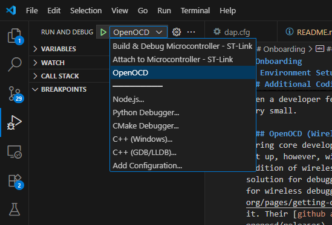
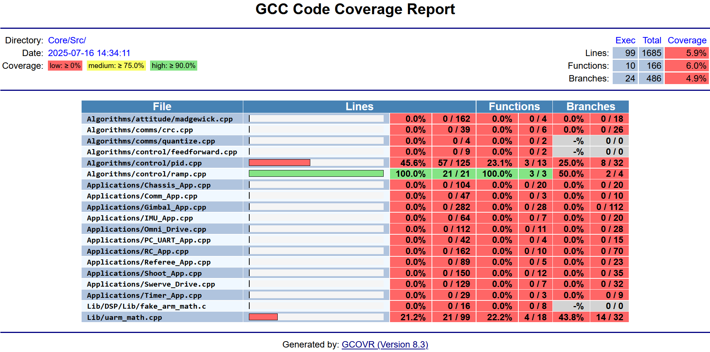
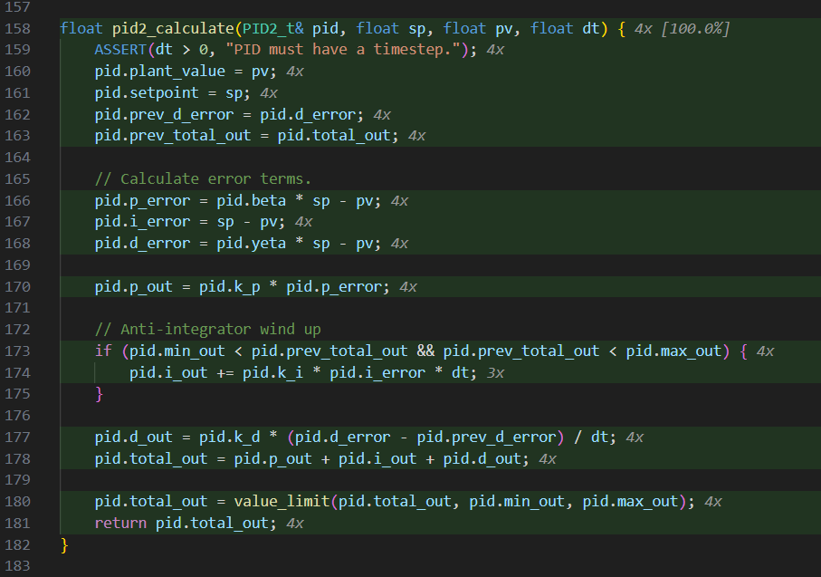

# Tooling
There are a few things that anyone who is interested in working with this codebase. 
This is a short guide to setting up an environment to start using developing this codebase as well as important system design choices which are strongly encouraged to be followed.

TODO Rewrite

## Tool Overview
Development is done on VSCode. VSCode was chosen because it was a modern IDE with support from STMicroelectronics in developing code for their chips in the form of their extension. 
It may be possible to use other IDEs, especially those specifically made for embedded development like CubeIDe, and Keil. However, setting up a development environment for those IDEs are not topics of this guide, you would have to look elsewhere for information regarding that. There are several tools are used in this project for various reasons, below is a table outlining them.

| Tool | Use | Description |
| --- | --- | --- |
| STM32Cube For Visual Studio Code | Primary interface for ST software and integrates packages for compiling, flashing, and debugging code on ST32 MCUs. | This is the official VSCode extension for developing STM32 MCUs created by STMicroelectronics themselves. It is a relatively new extension that is still undergoing development, but it has most of the features which CubeIDE (STM's own Eclipse-based IDE) has, albeit with some features having limited functionality. |
| CubeMX | No-code configuration and code generation for STM32 MCUs. | A GUI application which allows developers to easily graphically configure the various functionality of a MCU and generate the corresponding code to be used in an STM32 application. CubeMX can configure features ranging from clock speeds to middlewares (e.g. FreeRTOS) to pinouts. The tool is pretty versatile and should be learned to avoid tidious creation of set up code. |
||||

TODO finish table

## Core Development Tools

TODO Finish

## Additional Coding Tools
This are tools for making things related to development easiser (e.g. test coverage, formatting, etc.). These are not strictly necessary for development and can be left out, HOWEVER, IT IS ENCOURAGED THESE TOOLS ARE SET UP due to their usefulness and their assistance in keeping things like styling consistent. 
These tools work independently from one another, thus they can be incrementally adopted when a developer feels the need to incorporate them. The set up work required for each is very small.

### OpenOCD (Wireless Debugging)
During core development tools, tooling for wired flashing and debugging of STM32 MCUs were set up, however, wire connection is sometimes impractical or impossible to use so the addition of wireless flashing and debugging was added. OpenOCD is an open-source software solution for debugging embedded systems is used by the wireless "magic white boxes" we use for wireless debugging. To start setup simply goto the OpenOCD [website](https://openocd.org/pages/getting-openocd.html) and download the latest release windows binary and extract it. Their [github automatically generates these for you](https://github.com/openocd-org/openocd/releases). Afterwards, add the following setting to `.vscode/settings.json`.

```json
"OpenOCD.server_path": "<absolute filepath to openocd.exe>",
```

Make sure to include the `.exe` extension when setting your path otherwise the magic white boxes may not work. That's it! You have successfully finished set up of OpenOCD. To run a wireless debugging session, attach the TX box to your computer and the RX box to a MCU, navigate to `Run and Debug` on VSCode's sidebar, and select `OpenOCD` option for Run and Debug.



If you are getting errors while trying to do wireless debugging, investigate the following possible causes:
 1. The MCU is not getting power, thus the RX magic box is not being powered. You will know if the TX and RX magic boxes are connected by the blue LED on the top of the boxes. Make sure to connect the MCU to a sufficient power supply for it to power the RX magic box.
 2. Incorrect magic box pairs do not work with each other. Make sure you are using the correct pair of magic boxes (they are marked with colored tape on the back).
 3. (Most unlikely) Severed/broken SWD cable on RX box. Sometimes the wire connections from the RX magic box to the MCU are broken/incorrect, use a multimeter to verify continuity for each wire.

### Clang-format
Code style is a concern for any decently large project and it is often not worth the time and effort to manually format code to meet a specific style. Clang-format is an auto formatter that allows specific code style to be followed without much effort. A `.clang-format` file is already created with an acceptable style based on Google's C++ style guides. The C/C++ extension automatically installs clang-format, now it just needs to be configured to the developer's liking. It is recommended to add the following settings to `.vscode/settings.json` for bare minimum functionality.

```json
"C_Cpp.clang_format_style": "file", // Use settings in .clang-format file.
"C_Cpp.clang_format_fallbackStyle": "none", // No fallback style, simply leave it be.
"editor.formatOnSave": true, // Run clang-format after every file save.
```

Now clang-format will run after every file save and format the file contents to meet the style standard we use for the entire codebase. If you do not want this to happen, you can change the `editor.formatOnSave` setting to `false` and manually run `Format Document` using VSCode's command palatte.

### Gcovr and Gcov Viewer
Gcovr is a python library wrapper over GNU's gcov utility. In this project, the primary use of this lbirary is to generate code coverage reports and gcov data so we can see sections of code that are still untested. To set up Gcovr, make sure that python (3.11+) is downloaded and installed on your computer and you can use `venv` module. Next run the following to create a virtual environment.

```bash
python -m venv .venv
```

Once completed, activate the virtual environment using `Python: Select Interpreter` with VSCode's command palette. Next, install relevant python packages using the terminal.

```bash
pip install -r requirements.txt
```

Afterwards, make `out/coverage` folder in the base project directory then Gcovr should be ready for use. To set up Gcov Viewer, simply search and install the `Gcov Viewer` extension by Jacques Lucke. This extension shows tested and untested lines in the editor after we run tests. 

A vscode task has already been made to generate code coverage information using gcovr. Build and run `GTest` configuration and run all tests with coverage to generate gcov files. Run command palette and search for `Tasks: Run Task`. There will a list of avaiable tasks to run, select `GCOVR: generate test coverage (HTML)`. HTML files will populate `out/coverage` and you can view coverage by openning them in a web browser (the overview page is in `coverage_details.html`). Coverage should look similar to the following.



Each tested file will generate an individual page showing test line coverage. You can view them in the web browser or in VSCode by running `Gcov Viewer: Show` in command palette. Following the command, tested lines in their source files will be highlighed with a number showing the number of times they're ran. To turn off gcov viewer, run `Gcov Viewer: Hide`.

