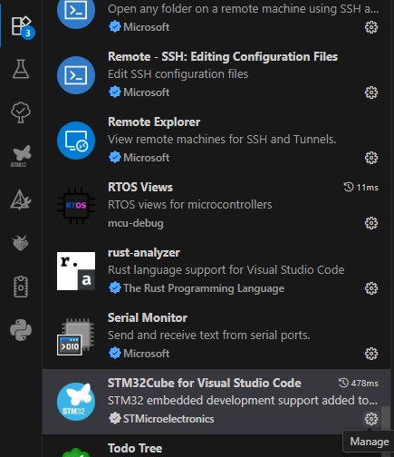
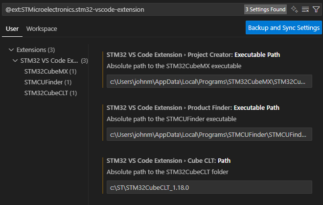
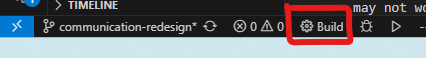
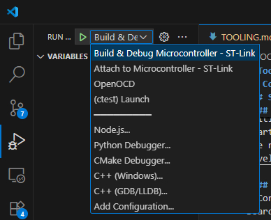
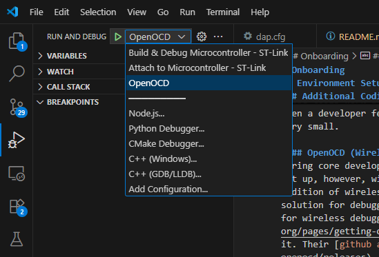
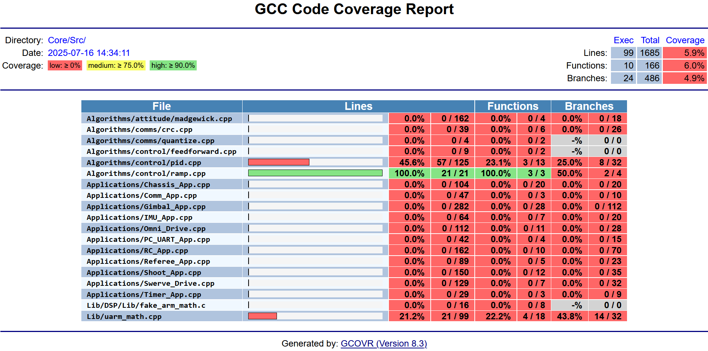
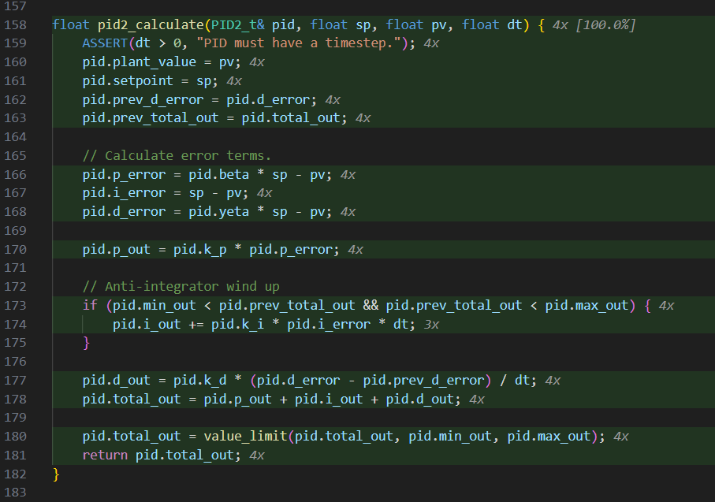

# Tooling
This document is intended to provide information about the tools that are used for developing our software for robots. Included below is an overview of what tools are used along with their rationale as well as installation instructions for primary development tools and additional tooling that we find helpful. The installation instructions were primarily made for Windows 11, however, there aren't any tools that are exclusive to the Windows system so setting up a developemnt environment on a different operating system should be possible. There are additional notes given for MacOS for some tools to help with setup.

## Tool Overview
Development is done on VSCode. VSCode was chosen because it was a modern IDE with support from STMicroelectronics in developing code for their chips in the form of their extension. 
It may be possible to use other IDEs, especially those specifically made for embedded development like CubeIDE, or Keil. However, instructions for setting up a development environment for those IDEs are not included in this guide you would have to look elsewhere for information regarding that. There are several tools used in this project for various reasons, below is a table outlining them.

| Tool | Use | Description |
| --- | --- | --- |
| STM32Cube For Visual Studio Code | Primary interface for ST software and integrates packages for compiling, flashing, and debugging code on ST32 MCUs. | This is the official VSCode extension for developing STM32 MCUs created by STMicroelectronics themselves. It is a relatively new extension that is still undergoing development, but it has most of the features which CubeIDE (STM's own Eclipse-based IDE) has, albeit with some features having limited functionality. |
| CubeMX | No-code configuration and code generation for STM32 MCUs. | A GUI application which allows developers to easily graphically configure the various functionalities of an MCU and generate the corresponding code to be used in an STM32 application. CubeMX can configure features ranging from clock speeds to middlewares (e.g. FreeRTOS) to pinouts. The tool is pretty versatile and should be learned to avoid tedious creation of setup code. |
| ST-Linkv2 and SWD | Communicating with MCU to perform code flashes and debugging. | ST-Link is a hardware device that physically connects and communicates between a computer and MCU over a wired connection. Serial Wire Debug (SWD) is a two wire interface protocol developed by ARM for debugging Cortex-M MCUs. It provides basic debugging capabilities, more functionality requires different interfaces. |
| CMake | Building codebase into executables, running tests, and generating documentation (Doxygen). | CMake is a cross-platform build system generator that creates build systems (e.g. Make, Ninja, etc.) which can compile the codebase into different executables based on a selected configuration. It can also be used to interface with different software libraries like GoogleTest and Doxygen to manipulate the codebase further (e.g. for testing). Basic understanding of CMake concepts (e.g. manipulating targets, different target types, propagation rules) is recommended to be effective at navigating this codebase. |
| GoogleTest, and Gcovr | Testing codebase and creating code test coverage information | GoogleTest is a popular C++ testing library with various functionality for unit testing, mocking, etc that are used to test functionality and regression of the codebase. Gcovr is a Python tool used to generate code test coverage reports for analysis. Testability should always be kept in mind during development. Understanding [GoogleTest](https://google.github.io/googletest/), and [GoogleMock](https://google.github.io/googletest/gmock_for_dummies.html) will help with determining how testable a piece of code is. See [testing strategy](./TESTING_STRATEGY.md) for more information about testing. |
| Git, GitHub, and GitHub Actions | Version control, project management, and automation of code quality checks. | Git is a popular version control tool that allows multiple developers to collaborate on a single project. Git is an industry standard and all developers must have a solid understanding of the basics (commits, branches, remotes, and resolving merge conflicts) and grasp about more advanced topics (e.g. submodules, history manipulation). GitHub is a popular host of git repos. GitHub features are heavily used to manage this codebase (projects, issues, pull requests, etc.) and developers should familiarize themselves with their correct usage. GitHub actions are used to automate quality checks (e.g. verifying compilation of all configurations, passing all tests.) whenever a merge request is created. These are to ensure certain basic requirements pass and `main` remains high quality. Understanding of GitHub Actions is unnecessary unless required to directly work with them. |

Required tools will be set up in the [Core Development Tools](#core-development-tools) section as well as a brief guide of how to use them. Additional quality of life tools are described in [Additional Coding Tools](#additional-coding-tools) section and can be optionally (but strongly encouraged to be) installed.

## Core Development Tools

Below are tools deamed to be the bare necessities for setting up a minimal development environment. Please take note of installation locations of software installed (particularly the STM prerequiste software packages) as they will be 

### STM32Cube for Visual Studio Code
This will be the primary development environment for developing this codebase. VSCode was choosen because of its popularity, modern IDE features, and its plethora of free extensions. The STM32Cube extension itself provides integration of CubeIDE features like project creation, code editing, building, flashing, and debugging into VSCode. The extension uses the same toolchain and device data packages used in STM32CubeIDE.  **Before installing this extension, ensure you have the prerequisites installed**. 

#### STM32CubeCLT
- STM32CubeCLT is a package containing toolchain and STM32 device related data required for project creation, build, and debug functionality. Without it, you cannot build or flash firmware. [Download](https://www.st.com/en/development-tools/stm32cubeclt.html) 

> It is unclear where CLT is installed when using the MacOS installer. From STM's UM3089, it suggests that the default location is in `/opt/ST/`. Open terminal and check if there is a newly created CLT folder there using `cd` and `ls` commands.

#### STM32CubeMX 
- STM32CubeMX simplifies the configuration of STM32 MCUs and generates the corresponding initialization C code.
Starting from v6.11.0, STM32CubeMX can generate VSCode-compatible CMake projects, eliminating the need for .cproject/.project conversion in CubeIDE. [Download](https://www.st.com/en/development-tools/stm32cubemx.html) 

#### ST-MCU-Finder
- Connects to and explores the full range of STM32 and STM8 microcontrollers, processors, dev boards, and examples, making it easier to select the correct device and reference code. [Download](https://www.st.com/en/development-tools/st-mcu-finder-pc.html) 

Upon installing the extension, you should receive a notification for configuring the extension to use the above software. You can configure the extension at any time by selecting `Manage` in the extension side menu and selecting `Settings`. 



Afterwards, a settings page will open with options to change path settings. Please read the descriptions carefully and configure them currently.

> Make sure to add the `.exe` file extension for executable file paths. Otherwise it may not work.



Due to how the project is configured, we use Ninja as the build system which has to be on your system before you can build the codebase. You can check if Ninja is installed by running the below in VSCode's terminal. You should see a version number as a result of your command.

```
ninja --version
```

If the above doesn't work, STM32CubeCLT may come with Ninja but it may not included in system PATH. Please check your CLT installation folder for a `Ninja` directory, if it exists, add the absolute path to `Ninja/bin` folder to your system PATH. If none of the above works, you'll have to install ninja separately.

### Ninja
> There are several ways to install Ninja, the below instructions directly downloads the binary and manually adds that to system PATH. However, you may want to use your system's package manager (e.g. homebrew) if you already have that setup.

Ninja is a small, high-speed build system designed to run builds generated by higher-level build configuration tools like CMake. Its main purpose here is to significantly speed up incremental builds, especially in large codebases, by only rebuilding what has changed. You can learn more about Ninja [from their website](https://ninja-build.org/). Please download your system's binary zip from their [github](https://github.com/ninja-build/ninja/releases), and extract it. Included in the zip should be an executable, please place this somewhere for safekeeping and add the parent folder to system PATH.


Now you should be able to build the entire codebase, and flash and debug using st-linkv2. You can build using the build button located at the botton toolbar of the IDE. Whenever, you flash and debug, a build will automatically run before. The flash and debug options are located under the debug menu on the side. Please use "Build & Debug Microcontroller - ST-Link" when you are debugging with an ST-Link.





## Additional Coding Tools
These are tools for making things related to development easier (e.g. test coverage, formatting, etc.). These are not strictly necessary for development and can be left out, HOWEVER, IT IS ENCOURAGED THESE TOOLS ARE SET UP due to their usefulness (e.g. OpenOCD, STM32CubeIDE) and their assistance in keeping things like styling consistent (clang-format). 
These tools work independently from one another, thus they can be incrementally adopted when a developer feels the need to incorporate them. The set up work required for each is very small.

### OpenOCD (Wireless Debugging)
During core development tools, tooling for wired flashing and debugging of STM32 MCUs were set up, however, wire connection is sometimes impractical or impossible to use so the addition of wireless flashing and debugging was added. OpenOCD is an open-source software solution for debugging embedded systems is used by the wireless "magic white boxes" we use for wireless debugging. To start setup simply go to the OpenOCD [website](https://openocd.org/pages/getting-openocd.html) and download the latest release Windows binary and extract it. Their [GitHub automatically generates these for you](https://github.com/openocd-org/openocd/releases). Select the precompiled binary package (usually ending with `mingw32`) and extract its contents.  Afterwards, add the following setting to `.vscode/settings.json` in your project directory. 

```json
"OpenOCD.server_path": "<absolute filepath to openocd.exe>",
```

Make sure to include the `.exe` extension when setting your path otherwise the magic white boxes may not work. That's it! You have successfully finished set up of OpenOCD. To run a wireless debugging session, attach the TX box to your computer and the RX box to a MCU, navigate to `Run and Debug` on VSCode's sidebar, and select `OpenOCD` option for Run and Debug.



If you are getting errors while trying to do wireless debugging, investigate the following possible causes:
 1. The MCU is not getting power, thus the RX magic box is not being powered. You will know if the TX and RX magic boxes are connected by the blue LED on the top of the boxes. Make sure to connect the MCU to a sufficient power supply for it to power the RX magic box.
 2. Incorrect magic box pairs do not work with each other. Make sure you are using the correct pair of magic boxes (they are marked with colored tape on the back).
 3. (Most unlikely) Severed/broken SWD cable on RX box. Sometimes the wire connections from the RX magic box to the MCU are broken/incorrect, use a multimeter to verify continuity for each wire.

### STM32CubeIDE
CubeIDE is an eclipse-based IDE developed by STmicroelectronics specifically for developing software for STM32 MCUs. The debugging capabilities in VSCode's STM32 extension is usually sufficient for most debugging, however, the liveWatch capabilities are lacking compared to CubeIDE. Oftentimes expressions are not displayed very quickly while the program is running ([this is due to problems with VSCode itself](https://github.com/Marus/cortex-debug/issues/810)) and sometimes entire expressions will not display if there are many of them in liveWatch. For these reasons, it is sometimes advantageous to use CubeIDE solely for real-time debugging.

Configuration for debugging with CubeIDE (both wired and wirelessly) is already included and all that is needed to be done is to install the IDE itself which can be done from the [respective page on ST's website](https://www.st.com/en/development-tools/stm32cubeide.html). Usage of CubeIDE in this manner is known to work for CubeIDEv1.18.1. Later verions may or may not work with the current configurations.

### Clang-format
Code style is a concern for any decently large project and it is often not worth the time and effort to manually format code to meet a specific style. Clang-format is an auto formatter that allows specific code style to be followed without much effort. A `.clang-format` file is already created with an acceptable style based on Google's C++ style guides. The C/C++ extension automatically installs clang-format, now it just needs to be configured to the developer's liking. It is recommended to add the following settings to `.vscode/settings.json` in your project directory for bare minimum functionality.

```json
"C_Cpp.clang_format_style": "file", // Use settings in .clang-format file.
"C_Cpp.clang_format_fallbackStyle": "none", // No fallback style, simply leave it be.
"editor.formatOnSave": true, // Run clang-format after every file save.
```

Now clang-format will run after every file save and format the file contents to meet the style standard we use for the entire codebase. If you do not want this to happen, you can change the `editor.formatOnSave` setting to `false` and manually run `Format Document` using VSCode's command palette.

### Gcovr and Gcov Viewer
Gcovr is a Python library wrapper over GNU's gcov utility. In this project, the primary use of this library is to generate code coverage reports and gcov data so we can see sections of code that are still untested. To set up Gcovr, make sure that Python (3.11+) is downloaded and installed on your computer and you can use `venv` module. Next run the following to create a virtual environment.

```bash
python -m venv .venv
```

Once completed, activate the virtual environment using `Python: Select Interpreter` with VSCode's command palette. Next, install relevant Python packages using the terminal.

```bash
pip install -r requirements.txt
```

Afterwards, make `out/coverage` folder in the base project directory then Gcovr should be ready for use. To set up Gcov Viewer, simply search and install the `Gcov Viewer` extension by Jacques Lucke. This extension shows tested and untested lines in the editor after we run tests. 

A vscode task has already been made to generate code coverage information using gcovr. Build and run `GTest` configuration and run all tests with coverage to generate gcov files. Run command palette and search for `Tasks: Run Task`. There will a list of available tasks to run, select `GCOVR: generate test coverage (HTML)`. HTML files will populate `out/coverage` and you can view coverage by opening them in a web browser (the overview page is in `coverage_details.html`). Coverage should look similar to the following.



Each tested file will generate an individual page showing test line coverage. You can view them in the web browser or in VSCode by running `Gcov Viewer: Show` in command palette. Following the command, tested lines in their source files will be highlighted with a number showing the number of times they're ran. To turn off gcov viewer, run `Gcov Viewer: Hide`.

